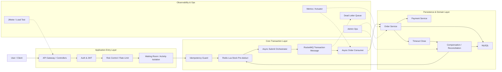

<div align="center">

# 🎫 Mock-Damai

### High-Concurrency Ticketing System

面向演唱会、大型活动等热点售票场景设计的高并发票务系统。

围绕抢票主链路实现 **流量削峰、库存防超卖、异步创单、事务消息、幂等控制、库存分桶、失败补偿与最终一致性**。

**Java 21 · Spring Boot 3.5 · MySQL 8 · Redis · RocketMQ · Kafka**


</div>

---

## 项目简介

Mock-Damai 是一个面向高并发票务场景的后端工程，项目内部服务名为 **SmartTicket Lite**。

它不以普通 CRUD 为核心，而是重点模拟热门演唱会、体育赛事等开售瞬间，大量用户竞争有限库存时会遇到的典型问题：

- 瞬时流量冲击；
- 热点库存竞争；
- 重复提交与幂等；
- Redis、MySQL、MQ 之间的一致性；
- 消息重复消费与失败恢复；
- 支付、取消、超时关闭带来的库存回滚；
- 下游消费能力不足时的背压与隔离。

> Redis 负责入口削峰和快速库存判断，MySQL 条件更新负责最终库存事实。  
> Redis 预扣成功不等于正式订单一定创建成功。

---

## 系统架构



### 抢票主链路

```text
JWT 鉴权
  ↓
获取一次性幂等 Token
  ↓
POST /api/orders/async
  ↓
风险控制 / 防重复
  ↓
用户 / IP / 活动 / 票档多维限流
  ↓
等待室 / 在途容量控制
  ↓
Redis Lua 原子预扣
  ↓
RocketMQ 事务消息
  ↓
异步消费者幂等抢占
  ↓
MySQL 条件扣减库存
  ↓
创建正式订单
  ↓
支付成功 / 主动取消 / 超时关闭
  ↓
库存确认或补偿
```

`requestId` 贯穿一次抢票请求的完整生命周期，用于请求幂等、Redis 预扣记录、消息追踪、异步结果查询和失败补偿。

---

## 核心设计

### 1. Redis Lua 原子预扣

抢票入口不会直接竞争 MySQL 热点库存行，而是先通过 Redis Lua 完成：

```text
库存检查
+
库存扣减
+
requestId 去重
+
预扣记录写入
```

这些操作在 Redis 内原子执行，避免应用层先查询库存再扣减所产生的竞态条件。

### 2. MySQL 最终防超卖

Redis 库存只承担入口削峰和快速失败。

消费者创建订单时仍使用类似以下条件更新：

```sql
UPDATE ticket_stock
SET available_stock = available_stock - ?
WHERE id = ?
  AND available_stock >= ?;
```

只有更新成功才继续创建订单，因此即使 Redis 发生缓存重建或人工修复，MySQL 仍保留最后一道防超卖边界。

### 3. 库存分桶

单个热门票档会形成 Redis 热点 Key。

项目支持将库存拆分为多个 Bucket，并通过有限探测窗口完成路由，降低单 Key 热点竞争。

当前包含：

- Bucket Version；
- Active Probe；
- Tail Bucket；
- The Porter 跨版本库存迁移；
- Lua CAS + Delta 修复。

### 4. RocketMQ 事务消息

默认异步下单使用 RocketMQ Transaction Message。

核心目标是降低以下状态长期存在的概率：

```text
Redis 已预扣
但
异步创单消息未可靠提交
```

主流程：

```text
发送 Half Message
        ↓
执行 Redis 预扣
        ↓
写入事务标记
        ↓
Commit / Rollback
```

Broker 无法判断事务结果时，可根据本地预扣状态执行事务回查。

### 5. 消费者幂等

消息链路按至少一次投递思路设计，因此消费者不能假设一条消息只会收到一次。

消费者首先尝试将请求状态从：

```text
QUEUED -> PROCESSING
```

只有成功抢占处理权的消费者继续创建正式订单，重复消息不会再次创建订单。

### 6. 最终一致性与补偿

Redis、MySQL 与 MQ 不存在天然单体事务，因此项目通过：

```text
状态机
+
事务消息
+
幂等
+
补偿
+
巡检
+
对账
```

共同完成可恢复的最终一致性。

例如：

```text
Redis 已预扣
↓
消费者创建订单失败
↓
记录失败状态
↓
按 requestId 幂等补偿 Redis
```

### 7. Backpressure 与活动隔离

入口不会无限接收请求并把压力全部转移给 MQ。

项目可结合：

- In-Flight Request；
- Local Message Backlog；
- Consumer Capacity；
- Activity Isolation；

对高峰流量进行背压和热点活动隔离，避免单个活动拖垮整个服务。

---

## 状态模型

### 异步抢票请求

`ticket_order_request`

```text
QUEUED -> PROCESSING -> SUCCESS
                     -> FAILED -> COMPENSATED
```

### 正式订单

`ticket_order`

```text
PENDING_PAYMENT -> PAID
PENDING_PAYMENT -> CANCELLED
PENDING_PAYMENT -> CLOSED
```

- `PAID`：支付成功；
- `CANCELLED`：用户主动取消；
- `CLOSED`：支付超时关闭。

---

## 开售前预约抢票

项目支持用户在开售前提前配置：

- 场次；
- 票档；
- 购买数量；
- 实名观演人。

形成 Purchase Plan 后：

**不会提前占库存，也不会提前创建正式订单。**

只有进入开售窗口后，用户主动提交预约方案，才会进入真实抢票链路。

```text
创建预约
↓
选择场次 / 票档 / 数量
↓
选择实名观演人
↓
完成预约
↓
等待开售
↓
手动提交抢票
↓
生成 requestId
↓
进入异步抢票主链路
```

详细领域语义见 [CONTEXT.md](CONTEXT.md)。

架构决策见 [预约与抢票提交分离 ADR](docs/adr/0001-预约与抢票提交分离.md)。

---

## 已实现能力

| 能力 | 当前实现 |
| --- | --- |
| 身份认证 | JWT、登录失败保护、Token 黑名单 |
| 幂等 | 一次性 Idempotency Token、requestId |
| 风控 | 用户/IP 频控、Gateway 决策接入 |
| 限流 | 用户、IP、接口、票档多维令牌桶 |
| 流量治理 | Waiting Room、Activity Isolation、Backpressure |
| 库存 | Redis Lua 预扣、库存分桶、售罄快速失败 |
| 最终库存 | MySQL 条件扣减 |
| 消息 | RocketMQ 事务消息、Kafka、Redis Stream、Outbox |
| 消费可靠性 | 幂等抢占、有限重试、DLQ |
| 一致性 | 补偿、巡检、对账、Lua CAS + Delta 修复 |
| 支付 | 支付单、HMAC-SHA256 模拟回调验签 |
| 订单闭环 | 支付、主动取消、超时关闭 |
| 预约购票 | Purchase Plan、实名观演人、版本冻结与对账 |
| 内容能力 | 演出搜索、艺人热榜 |
| 运维 | ADMIN / OPERATOR、库存调整、消息重试、审计 |
| 可观测性 | Actuator、Micrometer、业务指标、慢调用与消费追踪 |
| 测试 | JUnit 5、Testcontainers、JMeter |

---

## 技术栈

| 模块 | 技术 |
| --- | --- |
| Language | Java 21 |
| Framework | Spring Boot 3.5.13 |
| Web | Spring MVC |
| ORM | MyBatis-Plus |
| Database | MySQL 8 |
| Distributed Cache | Redis |
| Local Cache | Caffeine |
| Default MQ | RocketMQ |
| Optional MQ | Kafka |
| Optional Queue | Redis Stream |
| Reliable Message | Local Message / Outbox |
| Observability | Micrometer / Spring Boot Actuator |
| Testing | JUnit 5 / Testcontainers |
| Load Test | JMeter |

---

## 消息模式

| 场景 | 模式 | 说明 |
| --- | --- | --- |
| 异步创单 | `rocketmq`（默认） | 事务消息、顺序消费、事务回查 |
| 异步创单 | `kafka` | 按业务键分区，支持 Retry / DLT |
| 异步创单 | `redis-stream` | Consumer Group 消费 |
| 异步创单 | `outbox` | 本地消息表 + 定时投递 |
| 超时关闭 | `rocketmq`（默认） | 延迟消息 + 定时扫描兜底 |
| 领域事件 | 本地消息表 | 订单、支付、库存事件可靠投递 |

切换消息模式前，需要同步准备对应中间件、Topic / Consumer Group 和监控配置。

---

## Quick Start

### 1. 环境要求

- JDK 21
- Maven 3.9+
- MySQL 8+
- Redis 6+
- RocketMQ NameServer 与 Broker

Kafka 仅在主动切换到 Kafka 模式时需要。

### 2. 克隆项目

```bash
git clone https://github.com/zhubaozhenshuai666-lang/Mock-Damai.git
cd Mock-Damai
```

### 3. 初始化数据库

```bash
mysql -h 127.0.0.1 -P 3306 -u root -p -e '
CREATE DATABASE IF NOT EXISTS smart_ticket_lite
  DEFAULT CHARACTER SET utf8mb4
  DEFAULT COLLATE utf8mb4_0900_ai_ci;'

mysql -h 127.0.0.1 -P 3306 -u root -p smart_ticket_lite < docs/sql/schema.sql
mysql -h 127.0.0.1 -P 3306 -u root -p smart_ticket_lite < docs/sql/data.sql
```

如需补充索引，请先检查目标库现有索引，再执行：

```text
docs/sql/performance-indexes.sql
```

### 4. 本地配置

```bash
cp src/main/resources/application-local.example.yml \
src/main/resources/application-local.yml
```

设置本地环境变量：

```bash
export SMART_TICKET_DB_PASSWORD='your-db-password'
export SMART_TICKET_REDIS_PASSWORD=''
export SMART_TICKET_JWT_SECRET='a-local-secret-with-at-least-32-bytes'
export SMART_TICKET_ROCKETMQ_NAME_SERVER='localhost:9876'
```

真实密码和密钥不要提交到 Git。

### 5. 启动

```bash
mvn spring-boot:run
```

默认 HTTP 端口：

```text
8081
```

健康检查：

```bash
curl http://127.0.0.1:8081/actuator/health
```

---

## 核心 API

完整接口调试样例见 [docs/api/README.md](docs/api/README.md)。

| Method | API | Description |
| --- | --- | --- |
| `POST` | `/api/auth/register` | 用户注册 |
| `POST` | `/api/auth/login` | 用户登录 |
| `GET` | `/api/shows` | 查询已发布演出 |
| `GET` | `/api/search/shows?keyword=` | 演出搜索 |
| `GET` | `/api/rankings/artists?period=hot` | 艺人热榜 |
| `POST` | `/api/purchase-plans` | 创建预约计划 |
| `POST` | `/api/purchase-plans/{id}/submit` | 开售后提交预约抢票 |
| `GET` | `/api/orders/idempotency-token` | 获取一次性幂等 Token |
| `POST` | `/api/orders/async` | 异步抢票入口 |
| `GET` | `/api/order-requests/{requestId}` | 查询异步创单结果 |
| `POST` | `/api/payments/create` | 创建支付单 |
| `POST` | `/api/orders/{id}/cancel` | 取消待支付订单 |

后台运营接口位于：

```text
/api/admin/**
```

---

## 项目结构

```text
Mock-Damai
├── src
│   ├── main
│   │   ├── java/com/zewbby/smartticket
│   │   │   ├── controller
│   │   │   ├── service
│   │   │   ├── mq
│   │   │   ├── mapper
│   │   │   ├── config
│   │   │   ├── auth
│   │   │   └── ratelimit
│   │   └── resources
│   │       ├── mapper
│   │       ├── lua
│   │       └── application.yml
│   └── test
├── docs
│   ├── architecture
│   ├── adr
│   ├── api
│   ├── performance
│   └── sql
├── scripts
│   ├── jmeter
│   └── load
├── CONTEXT.md
├── AGENTS.md
└── pom.xml
```

---

## 测试与压测

运行测试：

```bash
mvn test
```

项目包含：

- 单元测试；
- MockMvc / Controller 测试；
- Service 测试；
- Mapper SQL 契约测试；
- MySQL / Redis 集成测试；
- MQ 相关测试；
- Testcontainers。

测试说明见 [src/test/README.md](src/test/README.md)。

### JMeter

JMeter 脚本位于：

```text
scripts/jmeter/
```

环境与运行辅助脚本位于：

```text
scripts/load/
```

正式压测方案见 [formal-jmeter-pressure-test-plan.md](docs/performance/formal-jmeter-pressure-test-plan.md)。

重点关注：

- TPS；
- P95 / P99 Latency；
- Error Rate；
- Redis / MySQL 库存一致性；
- MQ Backlog；
- In-Flight Request；
- Oversell Count。

> 本地压测结果仅用于开发阶段验证。  
> 在未完成独立压测机、多实例应用以及 Redis / MySQL / MQ 集群环境验证前，不将本机数据表述为生产容量结论。

---

## 当前阶段：Performance Engineering

当前项目的业务主链路已经基本完整，后续不再以继续堆叠“大麦业务功能”为主要目标。

Mock-Damai 接下来的定位是：

> **以票务抢购场景作为实验载体，系统性验证高并发、高可靠后端架构的性能边界、扩展能力与故障恢复能力。**

当前阶段按以下顺序推进：

### Phase 1 — Baseline

在**不修改核心业务实现**的前提下建立正式性能基线。

固定测试环境、数据规模和压测模型，分别记录：

- Submit TPS：入口接收抢票请求的吞吐；
- Order Creation TPS：异步消费者真正创建订单的吞吐；
- P95 / P99 Latency；
- Error Rate；
- MQ Consumer Lag；
- In-Flight Request；
- Redis / MySQL CPU 与连接使用情况；
- GC / JVM Thread 状态；
- Oversell Count。

重点不是追求一个孤立的高 TPS 数字，而是明确：

```text
系统可以接收多少请求
↓
下游每秒可以稳定处理多少订单
↓
积压从哪里开始出现
↓
第一个真实瓶颈是什么
```

### Phase 2 — Bottleneck Profiling

基于 Baseline 对完整链路进行 Profiling，不预设瓶颈。

重点观察：

```text
HTTP / Thread Pool
Redis Lua
Redis Hot Key
RocketMQ Producer / Consumer
Consumer Worker
MySQL Connection Pool
MySQL Row Lock
Order Transaction
JVM / GC
```

最终形成 Bottleneck Report，记录不同并发档位下真正限制吞吐的组件。

### Phase 3 — Targeted Optimization

只针对已经通过数据确认的瓶颈做优化，并保留完整 Before / After 对照。

优先验证的实验包括：

- Consumer Worker 数量调优；
- 单条消费 vs Batch Consumer；
- 单条写入 vs Batch Insert；
- Stock Bucket 数量对 Redis 热点竞争的影响；
- Backpressure 阈值与 MQ Lag 的关系；
- MySQL 热点行与事务范围优化。

每一次优化都需要记录：

```text
Problem
↓
Baseline
↓
Change
↓
Result
↓
Trade-off
```

### Phase 4 — Multi-Instance Validation

从单实例扩展到至少两个应用实例，重点验证：

- requestId 幂等是否仍成立；
- Redis 库存是否仍然不超卖；
- 是否存在依赖单机本地锁的逻辑；
- 定时任务是否重复执行；
- MQ 重复消费是否会重复创单；
- 缓存与状态是否能够正确收敛。

该阶段关注的是**横向扩展后的正确性**，而不是单机 TPS 数字。

### Phase 5 — Failure Injection

主动制造关键故障，验证系统能否恢复：

- Redis 预扣后应用实例异常退出；
- MQ 消费后数据库事务回滚；
- 同一消息重复投递；
- 支付成功回调重复到达；
- Consumer 暂停后形成 MQ Lag，再恢复消费；
- Redis 短暂不可用；
- 补偿任务或对账任务重复执行。

目标是验证事务消息、幂等、补偿、DLQ、巡检和对账机制是否真正有效，而不仅仅是代码中“存在这些设计”。

### Phase 6 — Benchmark & Architecture Report

最终产出可复现的实验报告，包括：

- 测试环境；
- 数据规模；
- 压测模型；
- Baseline；
- 瓶颈定位过程；
- 优化前后对比；
- 多实例结果；
- 故障恢复结果；
- 已知边界与 Trade-off。

在正式结果完成前，README 不使用未经验证的“10W QPS”“生产级吞吐”等宣传性数字。

---

## 文档导航

| 文档 | 内容 |
| --- | --- |
| [docs/README.md](docs/README.md) | 文档总入口 |
| [system-flow-reading-guide.md](docs/architecture/system-flow-reading-guide.md) | 系统主链路源码阅读 |
| [artist-ranking-design.md](docs/architecture/artist-ranking-design.md) | 搜索与热榜设计 |
| [docs/adr](docs/adr) | Architecture Decision Records |
| [docs/api](docs/api) | API 请求样例 |
| [docs/performance](docs/performance) | 压测设计 |
| [docs/sql](docs/sql) | SQL 与数据库初始化 |
| [CONTEXT.md](CONTEXT.md) | 领域语言与业务边界 |

---

## Roadmap

### 已完成

- [x] JWT 用户认证
- [x] 一次性幂等 Token
- [x] 多维限流与风控
- [x] Waiting Room
- [x] Activity Isolation
- [x] Redis Lua 原子库存预扣
- [x] 库存分桶与 The Porter
- [x] RocketMQ 事务消息
- [x] Kafka / Redis Stream / Outbox 可切换消息模式
- [x] 消费者幂等与 DLQ
- [x] 库存补偿、一致性巡检与对账
- [x] 支付、取消、超时关闭
- [x] 预约抢票与实名观演人
- [x] 演出搜索与艺人热榜
- [x] Actuator / Micrometer
- [x] JMeter 压测脚本

### 后续验证方向

- [ ] 多实例应用部署
- [ ] Redis Cluster
- [ ] RocketMQ / Kafka 集群
- [ ] MySQL 主从与读写分离
- [ ] Gateway 层统一风控与限流
- [ ] Prometheus + Grafana
- [ ] OpenTelemetry 全链路追踪
- [ ] 独立压测环境
- [ ] 多实例正式容量测试
- [ ] 故障注入与恢复测试

---

## 设计边界

1. `mock-pay` 为本地模拟支付，不接入真实第三方支付 SDK。
2. Redis 预扣负责削峰与快速失败，MySQL 条件扣减才是正式库存事实。
3. RocketMQ 事务消息、补偿、巡检和对账解决的是可恢复的最终一致性问题，不代表 Redis、MySQL 与 MQ 之间存在严格 ACID 分布式事务。
4. 本地 JMeter 测试数据不能直接代表生产容量。
5. 项目当前主要用于高并发票务系统架构学习、工程实践和性能验证。

---

## License

当前仓库暂未声明正式开源许可证。

如果后续作为公开作品长期维护，建议在明确代码开放范围后补充独立的 `LICENSE` 文件。

---

<div align="center">

**Mock-Damai**

Building a reliable ticketing system under high concurrency.

</div>
